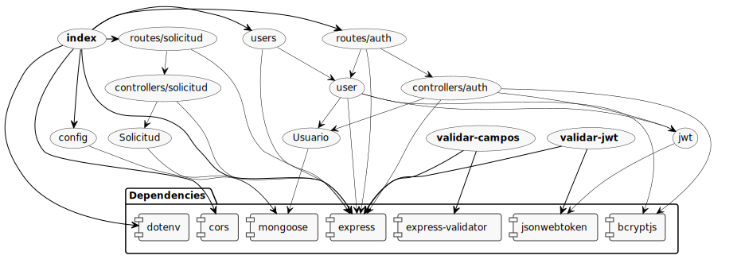

<h1 align="center">
   <b> ⚙️ Consejo de Facultad</b> 
</h1>
<p align="center">Proyecto académico para Ingeniería de Software I</p>


## 🐳 Docker-way to quick start

Primero, debe instalar [docker](https://docs.docker.com/engine/install/) 
 
Después clone el proyecto

```bash
git clone git@github.com:Sebas03446/consejo-de-facultad.git
```

```bash
docker build . -t scf/node-web-app
```
Ejecute la imagen

```bash
docker run -p 49160:3001 -d scf/node-web-app
```
>Si desea acceder a los endpoint debe acceder por medio del puerto localhost:49160/ 

## Sin Docker
 Si quiere realizar la instalación sin docker, tiene que instalar node version > 14.16.7. Después, debe ejecutar los siguientes comandos.

Instalación de librerias
```bash
npm i
```
Ejecutar el server
```bash
npm start
```
## Diagrama de dependencias

